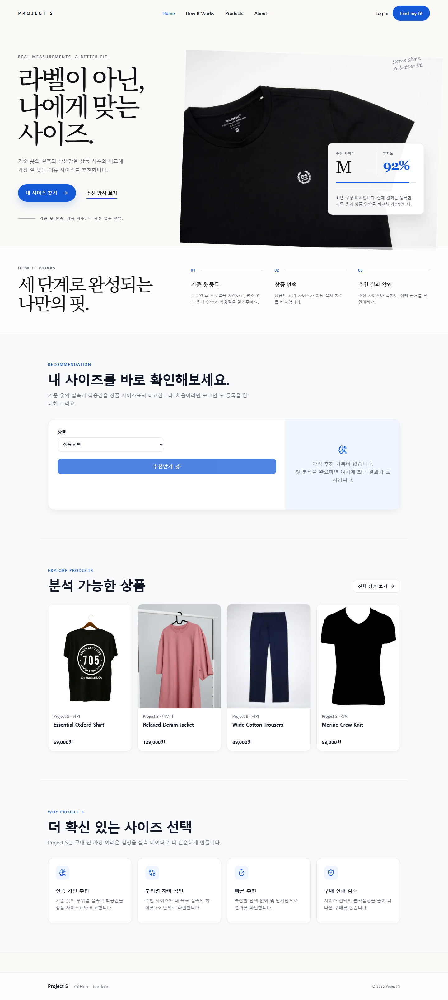
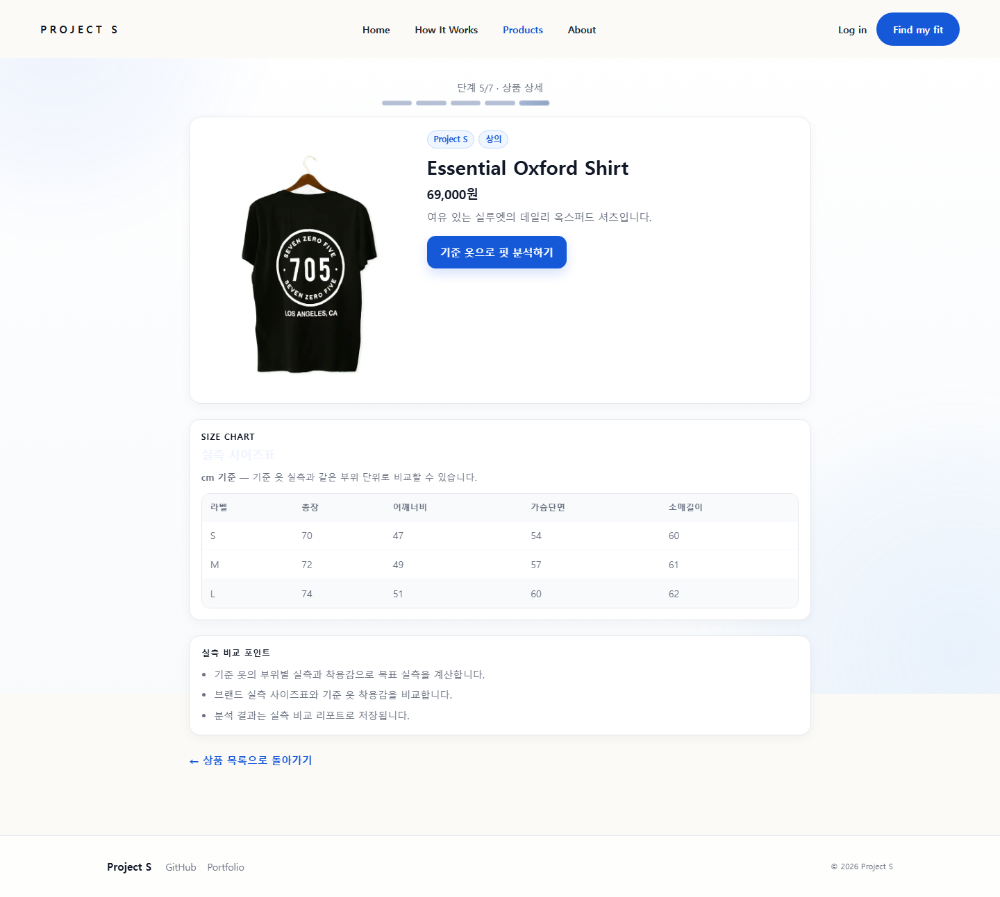
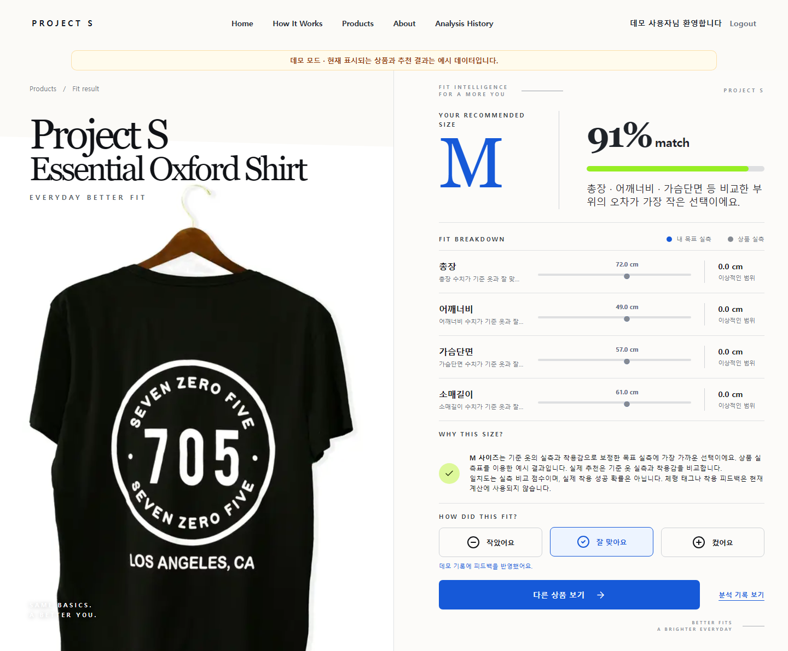
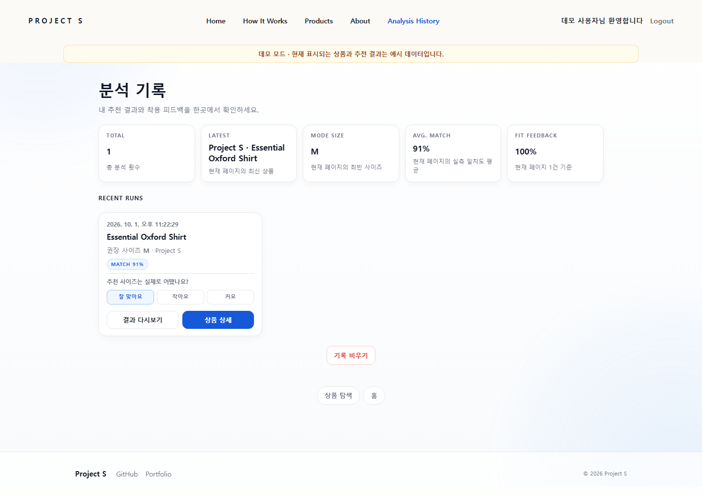
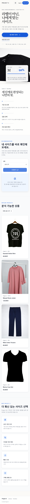
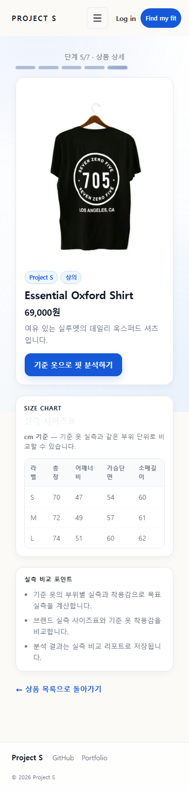
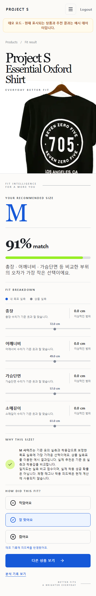
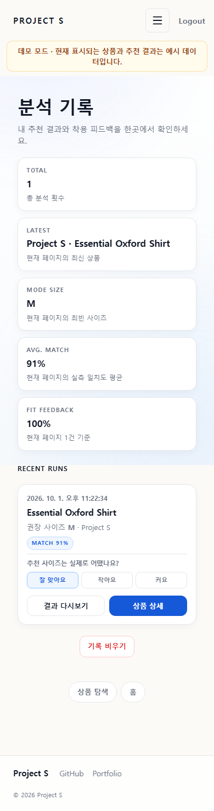

# Project S

> 사용자의 체형과 기준 의류(My Fit)를 상품 실측과 비교해 적절한 의류 사이즈를 추천하는 풀스택 웹 서비스


## 프로젝트 소개

같은 `M` 사이즈라도 브랜드와 상품마다 실제 치수가 달라 온라인에서는 사이즈를 정확히 선택하기 어렵습니다. Project S는 사용자의 Body Profile과 기준 의류를 순차적으로 등록하고, 현재 추천 엔진은 My Fit의 실측 및 착용감과 상품 실측을 비교하여 적절한 사이즈를 추천합니다.

Next.js 프론트엔드와 Spring Boot API를 분리하고, 추천 계산을 독립적인 Calculator로 구성해 화면·비즈니스 흐름·계산 책임을 나눴습니다. 현재 핵심 MVP 기능을 구현했으며 Ubuntu Server에 프론트엔드와 백엔드를 직접 배포한 상태입니다. 상세 배포 설정 중 저장소에서 확인되지 않는 내용은 [배포 문서](docs/deployment.md)에 TODO로 구분했습니다.

## 주요 기능

| 기능 | 설명 |
| --- | --- |
| 회원 | 회원가입, 로그인, JWT 인증, 로그인 사용자 조회 |
| Body Profile | 키, 몸무게, 성별, 체형 특징 등록·조회·수정 |
| My Fit | 상·하의 기준 의류와 부위별 실측·착용감 등록·조회·수정 |
| 상품 | 상품 목록·상세 및 사이즈별 실측 조회 |
| 사이즈 추천 | My Fit과 상품 실측을 비교해 추천 사이즈, Match Score, 비교 근거 제공 |
| 추천 기록 | 최근 추천 결과를 브라우저 Local Storage에 저장 |

서비스 흐름은 `회원가입 → 로그인 → Body Profile → My Fit → 상품 선택 → 추천 → 결과 저장` 순서입니다.

## 기술 스택

| 영역 | 기술 |
| --- | --- |
| Frontend | Next.js 15, React 19, TypeScript, Zustand, TanStack Query, CSS Modules, Framer Motion |
| Backend | Java 17, Spring Boot 3, Spring Security, JWT, Spring Data JPA, Hibernate, Gradle |
| Database | PostgreSQL, H2(Test) |
| Deployment | Ubuntu Server, VirtualBox, Apache Reverse Proxy, systemd |

## 프로젝트 구조 요약

```text
project-S/
├── frontend/                 # Next.js App Router 애플리케이션
│   └── src/
│       ├── app/              # 라우트
│       ├── components/       # 공통 UI와 레이아웃
│       ├── features/         # 기능별 UI·API·상태
│       ├── lib/              # API Client와 공통 유틸리티
│       └── stores/           # 전역 상태
├── backend/                  # Spring Boot API
│   └── src/main/java/com/projects/backend/
│       ├── auth/             # 로그인과 JWT
│       ├── member/           # 회원
│       ├── bodyprofile/      # 체형 프로필
│       ├── myfit/            # 기준 의류
│       ├── product/          # 상품과 실측
│       ├── recommendation/   # 추천 흐름과 계산기
│       └── common/           # 보안·응답·예외 설정
└── docs/                     # 설계·배포·기록 문서
```

자세한 구조와 설계 이유는 [Architecture](docs/architecture.md)를 참고해 주세요.

## 로컬 실행 방법

### 1. 저장소 복제

```bash
git clone https://github.com/Bumjun-hub/Project-S.git
cd Project-S
```

### 2. PostgreSQL 준비

기본 데이터베이스 이름은 `project_s`입니다. 실제 비밀번호와 JWT Secret은 저장소에 커밋하지 않고 환경변수로 전달합니다.

```bash
export DB_URL='jdbc:postgresql://localhost:5432/project_s'
export DB_USERNAME='postgres'
export DB_PASSWORD='your-password'
export JWT_SECRET='replace-with-a-secure-secret'
```

### 3. 백엔드 실행

```bash
cd backend
./gradlew bootRun
```

기본 주소는 `http://localhost:8080`이며 Health API는 `/api/v1/health`입니다.

### 4. 프론트엔드 실행

새 터미널에서 실행합니다.

```bash
cd frontend
npm install
npm run dev
```

기본 주소는 `http://localhost:3000`입니다. 현재 API Client의 기본값은 동일 출처 요청이므로 개발 서버를 분리해 실행할 때는 아래 환경변수를 설정합니다.

```bash
NEXT_PUBLIC_API_BASE_URL=http://localhost:8080 npm run dev
```

## 프로젝트 스크린샷

아래 이미지는 **실제 구현된 화면**을 로컬 데모 환경에서 Playwright Chromium으로 캡처한 것입니다(2026-10-01).
상품·추천 결과·피드백은 예시 데이터이며, 실제 회원 정보나 운영 DB를 사용하지 않았습니다.
데스크톱은 1440×1000, 모바일은 390×844 뷰포트에서 전체 페이지를 캡처했습니다.
모바일 이미지는 Chromium 에뮬레이션이며 실제 기기·Safari 검증을 의미하지 않습니다.

### 랜딩 페이지

서비스 소개, 기준 옷 기반 추천 흐름, 상품 탐색으로 이어지는 진입 화면입니다.



### 상품 상세·사이즈표

상품 정보와 사이즈별 실측을 확인하고 기준 옷 기반 핏 분석을 시작합니다.



### 추천 결과·피드백

추천 사이즈·실측 일치도·부위별 차이와 착용 피드백을 한 화면에서 확인합니다.



### 분석 기록 대시보드

분석 횟수·추천 사이즈·일치도·피드백 요약과 저장된 결과 다시보기를 제공합니다.
아래 화면은 데모 UI에서 추천과 피드백을 남긴 뒤 새로고침하여 캡처했습니다.
데모의 브라우저 저장 동작은 실제 API·PostgreSQL 연동 검증을 대체하지 않습니다.



<details>
<summary>모바일 화면 4개 보기</summary>

#### 랜딩 페이지



#### 상품 상세·사이즈표



#### 추천 결과·피드백



#### 분석 기록 대시보드



</details>

캡처를 갱신하려면 `frontend`에서 `npm run screenshots`를 실행합니다.
실행 조건과 개인정보 보호 방식은 [화면 캡처 안내](frontend/docs/screenshots/README.md)를 참고해 주세요.
공개 서비스 URL은 실제 배포 주소 확인 후 별도로 추가해야 합니다.

## 문서

| 문서 | 내용 |
| --- | --- |
| [Architecture](docs/architecture.md) | 시스템 구조, 도메인, 추천 엔진, API와 설계 결정 |
| [Deployment](docs/deployment.md) | Ubuntu·VirtualBox 기반 수동 배포 구조와 운영 방법 |
| [Troubleshooting](docs/troubleshooting.md) | 프로젝트에서 확인된 문제, 원인, 해결과 배운 점 |
| [Development Log](docs/development-log.md) | Git 이력과 구현 결과를 기준으로 정리한 개발 일지 |
| [Roadmap](docs/roadmap.md) | Docker, HTTPS, CI/CD 등 후속 작업 |

## Vercel 데모 배포

사용자 흐름을 별도의 설치 과정 없이 확인할 수 있도록 프론트엔드를 Vercel에 배포했습니다. 백엔드가 배포되지 않은 환경에서도 서비스 경험을 보여줄 수 있도록 데모 모드를 제공합니다.

데모 모드에서는 다음 흐름을 직접 체험할 수 있습니다.

```text
로그인 → 체형 정보 입력 → 기준 옷 치수·착용감 입력 → 상품 탐색 → 사이즈 추천 결과 확인
```

- 상품 목록·상세와 추천 결과는 예시 데이터로 제공됩니다.
- 입력한 체형 및 기준 옷 정보는 데모 브라우저 내에서만 사용되며 실제 서버에 저장되지 않습니다.
- 화면 상단의 `데모 모드` 안내를 통해 예시 데이터가 표시 중임을 확인할 수 있습니다.

Vercel 배포 환경에는 아래 환경변수를 설정합니다.

```env
NEXT_PUBLIC_DEMO_MODE=true
```

실제 백엔드를 연결할 때는 `NEXT_PUBLIC_DEMO_MODE=false`로 변경하고 `NEXT_PUBLIC_API_BASE_URL`에 배포된 API 주소를 설정한 뒤 다시 배포합니다.

---

[문서 홈](docs/architecture.md) · [배포](docs/deployment.md) · [트러블슈팅](docs/troubleshooting.md) · [개발 일지](docs/development-log.md) · [로드맵](docs/roadmap.md)
